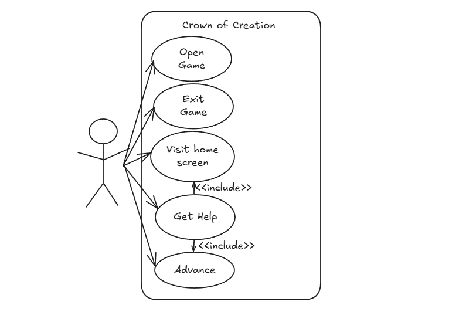
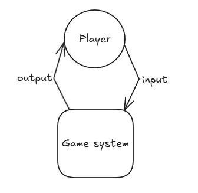
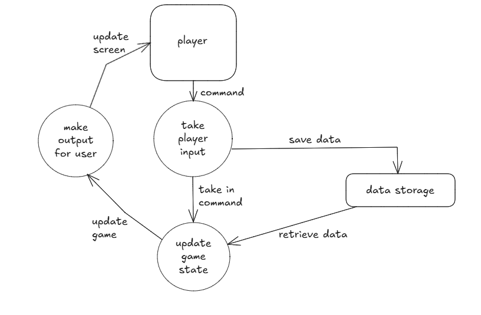

# 11SE Assessment Task 2

## By Maksim Kniazev

# Sprint 1
## Requirements defintion
### Functional Requirements
* Data Retrieval: The user must be able to view their character and the game while they play it. The user must be able to play the game and view what they're doing regarding their gameplay.
* User Interface: To interact with the system, the user must move their mouse/keypad. The user also needs a working computer and connection to the internet.
* Data Display: The user must be able to obtain certain information about their character such as their health, strength and other aspects. The output for the user must be the desired information regarding their game and character.
### Non-functional Requirements
* Performance: The system must perform to the users standards and if problems are encountered in the code, they must be solved straight away. The system must function on all computers with the most recent versions of python.
* Reliability: The system and data must be reliable to the level where the user understands everything that happens and trusts the code completely.
* Useability and Accessibility: The system must be very easily navigated and the user must know what is happening and where everything is.

## Determining Specifications
### Functional Specifications
* User Requirements: The user must be able to move their character, potentailly solve problems in-game and fight bosses. These aspects build up the game and help the user to understand what is happening and how the game works
* Inputs and Outputs: The system must accept what the user writes/chooses to do in-game such as move or fight a boss. The code must then output exactly what the user does and what they decide their character should do.
* Core features: At its core, the program must be able to run the game successfully and everything must work to the users standards. The user must be able to do various things such as move their character, fight enemies and solve puzzles
* User Interaction: To interact with the system, the user must move their arrowkeys and potentailly write things to solve puzzles. To fight the bosses, the user must choose certain attacks using the space bar.
* Error Handling: Errors I could face during the code could include a breach of data integrity, this could be solved by updating your version of python and fixing your code for bugs and glitches. Menu navigation can also be confusing for new users, this can be solved by reading and understanding the program better.
### Non-Functional Specifications
* Performance: The system must perform simple tasks to the users expectations. If these standards are not met, the maintenance of user engagement drops and the code fails. To ensure that the program is efficient, it is important to make sure that python is updated to the newest version or the version where the code was made.
* Reliability: To make the application more accessible, I could make a very in-depth README file to increase simplicity in my code. To improve the User Interface (UI), I could make it easier to understand and rely on design as well as functionality of the system
* Useability/Accesibility: An issue that I could face in the code is menu navigation doing the wrong thing. This decreases user engagement and can be solved by fixing certain aspects in the code which cause the issue. To prevent complications like data integrity and illogical calculation, user must make sure that their versions of python are fully updated.

## Use Cases

### Actors: Player/User

### Preconditions: The user must have tkinter and the plot file

### Main Flow: First of all, the user runs the code and enters the game, then the user chooses to either leave the game, start the game or get help on what to do.

### Alternative Flows (if needed): The user could leave the game and need help

### Postconditions: The expected outcome is either the user loses and the game displays game over or the user wins and a victory screen is displayed

## Use Case Diagram:

## Storyboard:  

## Level 0 Data Flow Diagram:

## Level 1 Data Flow Diagram:

## End of Sprint 1 Questions (Review): 

### 1. Evaluate how effectively your project meets the functional and non-functional requirements defined in your planning: My project meets the Functional and Non-Functional requirements well as it does evrything described in them. It runs smoothly and is up to my standards. My project has a successful User Interface, Data Display and Data Retrieval. It is reliable and very useable.

### 2. Analyse the performance of your program against the key use-cases you identified: My project performs well considering the use cases I identified, the preconditions are first met, the main flow works to my expectations and the base alternative flows are succesful. Being in this stage of the code, I have not completely begun adding classes or implementing the UI but considering where I am in the project, the performance of my program is going well.

### 3. Assess the quality of your code in terms of readability, structure, and maintainability: The quality so far is up to strandards as it is simple to understand, the structure is good and it will allow me to further progress my project much easier due to how much I understand what I need to do and what is going on. The code is easy to maintain and I predict that the final result will be very understandable and easy to maintain.

### 4. Explain the improvements that should be made in the next stage of development: In the next stage of development (Sprint 2), I will begin on making the UI which will then shape my understanding of what the result must look like. I will also add the text that will be displayed in my code and introduce the character and possible enemies. While my code now is good for Sprint 1, there is no doubt that it must be improved for further implementation of code.

## End of Sprint 2 Questions (Review): 

### 1. Evaluate how effectively your project meets the functional and non-functional requirements defined in your planning: For Sprint 2, my project meets the functional and non-functional requirements quite effectively. I have begun implementing the backstory for the game and displaying it in my UI. My functional and non-functional requirements for Sprint 2 have been met as the current performance is acceptable for where I am in my project.

### 2. Analyse the performance of your program against the key use-cases you identified: For where I am in the code, the use-cases have not entirely been met but I am working on succesfully displaying the game. For now, I have started to work on the 'quit' button which will exit the game (Alternative Flow). Although I am working on the Main Flow more in Sprint 3, for now it is successful and easily understandable.

### 3. Assess the quality of your code in terms of readability, structure, and maintainability: My code is currently very understandable for a Sprint 2 standard. The UI is currently unfinished as I still need to add more alternative flows and work on the main flow. The readability however is very successful and simple. The structure of the code is very well prepared for future update, this is good because in Sprint 3 I will start to implement classes.

### 4. Explain the improvements that should be made in the next stage of development: In Sprint 3, I will begin to implement classes which will greatly help me enhance my code. By implementing classes, the code will become much simpler and easier to navigate. Classes will allow me to implement items and battle feature which will make my game much better than it currently is. I can also add a 'help' button to explain to the user what they must do in my game.

## End of Sprint 3 Questions (Review): 

### 1. Evaluate how effectively your project meets the functional and non-functional requirements defined in your planning: Now that I can start to add classes to my code, the game has become much easier to manoeuvre as it now has defined the main characters class options (Rogue, Pirate, etc). This effectively meets the functional and non-functional requirements as it has improved the UI and made the data easier to display.

### 2. Analyse the performance of your program against the key use-cases you identified: The performance of my program very much reflects my use cases. After the preconditions are met, the code greatly highlights the main flow and post-conditions. I have also implemented a 'quit' button and a 'help' button, these are my alternative flows. after the user either wins or loses, a winning or losing screen is displayed where the user can then choose to either quit the game or restart.

### 3. Assess the quality of your code in terms of readability, structure, and maintainability: My code and UI is very easy to understand as the instructions are very clear and if the user is still confused, they can access a help screen which explains the goal of the game and the combat system. As described, my games structure is quite simple and the maintainability is good considering that the user has tkinter and a working version of python.

### 4. Explain the improvements that should be made in the next stage of development: In the final sprint, I need to add the bosses/fighting system, I also need to improve the UI by changing the fonts, background and overall UI. By doing this, I will have finished my code for the project. Improving the UI will make the project more understandable and simpler.

## End of Sprint 4 Questions (Review): 

### 1. Evaluate how effectively your project meets the functional and non-functional requirements defined in your planning: My project meets the functional and non-functional requirements well because it does everything shown in them. Some examples of this are: data retrieval, UI, data display, performance, reliability and useablity. My program is very reliable as it currently has no complications, it is also very useable and understandable.

### 2. Analyse the performance of your program against the key use-cases you identified: Considering what is in my use-cases, the games performance is exceptional. All the pre and post conditions have been met and they work very well. The idea for the main flow has been met and the alternative flows have been added.

### 3. Assess the quality of your code in terms of readability, structure, and maintainability: My final project is very readable and understandable. The UI is very simple and easy to understand. For example, when fighting a boss, it clearly shows your remaining health and how much damage you do to the enemy. Also, when choosing a class for your character, a summary of the characters attributes is shown which makes the game very maintainable and readable. I can confidently say that there is no function which the user can't understand if they read the help window.

### 4. Explain the improvements that should be made in the next stage of development: If I were to further improve my game, I would patch vulnerabilities that the user might be exploiting. I would also potentially make the game look better by adding things such as health bars or other nifty things. I would also add a function which would save your progress in the game and load your progress if re-opening the game.