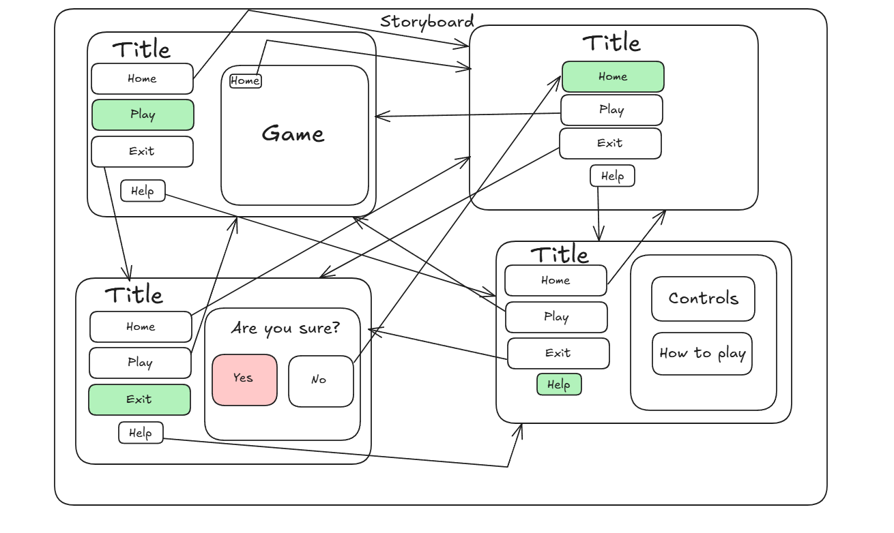

# 11SE Assessment Task 2

## By Maksim Kniazev

# Sprint 1
## Requirements defintion
### Functional Requirements
* Data Retrieval: The user must be able to view their character and the game while they play it. The user must be able to play the game and view what they're doing regarding their gameplay.
* User Interface: To interact with the system, the user must move their mouse/keypad. The user also needs a working computer and connection to the internet.
* Data Display: The user must be able to obtain certain information about their character such as their health, strength and other aspects. The output for the user must be the desired information regarding their game and character.
### Non-functional Requirements
* Performance: The system must perform to the users standards and if problems are encountered in the code, they must be solved straight away. The system must function on all computers with the most recent versions of python.
* Reliability: The system and data must be reliable to the level where the user understands everything that happens and trusts the code completely.
* Useability and Accessibility: The system must be very easily navigated and the user must know what is happening and where everything is.

## Determining Specifications
### Functional Specifications
* User Requirements: The user must be able to move their character, potentailly solve problems in-game and fight bosses. These aspects build up the game and help the user to understand what is happening and how the game works
* Inputs and Outputs: The system must accept what the user writes/chooses to do in-game such as move or fight a boss. The code must then output exactly what the user does and what they decide their character should do.
* Core features: At its core, the program must be able to run the game successfully and everything must work to the users standards. The user must be able to do various things such as move their character, fight enemies and solve puzzles
* User Interaction: To interact with the system, the user must move their arrowkeys and potentailly write things to solve puzzles. To fight the bosses, the user must choose certain attacks using the space bar.
* Error Handling: Errors I could face during the code could include a breach of data integrity, this could be solved by updating your version of python and fixing your code for bugs and glitches. Menu navigation can also be confusing for new users, this can be solved by reading and understanding the program better.
### Non-Functional Specifications
* Performance: The system must perform simple tasks to the users expectations. If these standards are not met, the maintenance of user engagement drops and the code fails. To ensure that the program is efficient, it is important to make sure that python is updated to the newest version or the version where the code was made.
* Reliability: To make the application more accessible, I could make a very in-depth README file to increase simplicity in my code. To improve the User Interface (UI), I could make it easier to understand and rely on design as well as functionality of the system
* Useability/Accesibility: An issue that I could face in the code is menu navigation doing the wrong thing. This decreases user engagement and can be solved by fixing certain aspects in the code which cause the issue. To prevent complications like data integrity and illogical calculation, user must make sure that their versions of python are fully updated.

## Use Cases

## Storyboard:  

